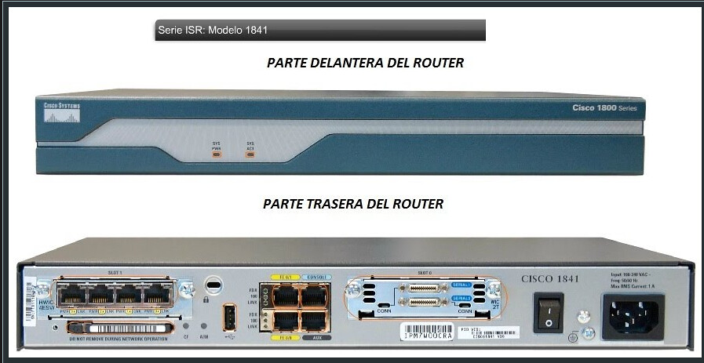
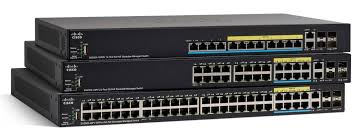
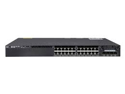
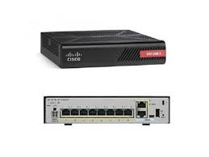
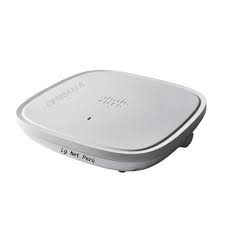
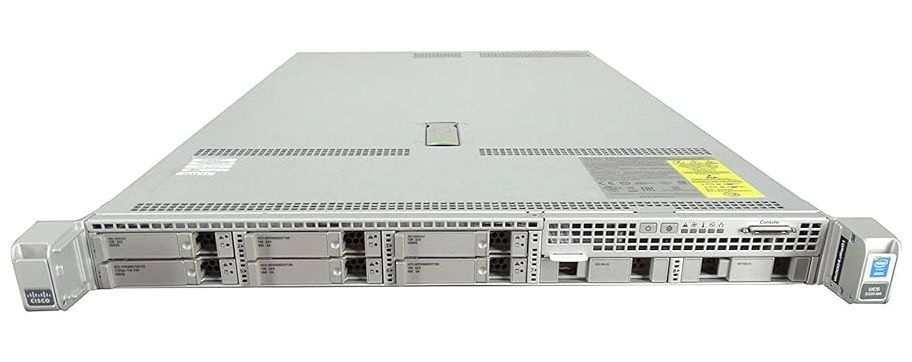
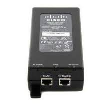

# 📡 Componentes Principales de Red

Este documento ofrece una visión detallada de los principales dispositivos que conforman una red moderna, acompañados de diagramas visuales para facilitar su comprensión.

## 🔁 Router

Un **router** es un dispositivo de **capa 3 (red)** que permite enrutar paquetes entre diferentes redes. Es esencial para conectar redes locales (LAN) con redes externas como Internet.

### ¿Qué significa "enrutar"?

En redes, **enrutar** se refiere al proceso de **dirigir paquetes de datos desde su origen hasta su destino**, utilizando la mejor ruta disponible.

### 🧠 Ejemplo:
- Un paquete enviado desde una computadora en la red LAN debe llegar a un servidor en Internet. El router determina la mejor ruta y lo envía hacia el siguiente salto.

### Funcionamiento básico:
1. Recibe el paquete en una interfaz.
2. Analiza la dirección IP de destino.
3. Consulta su tabla de enrutamiento.
4. Envía el paquete por la interfaz adecuada.

## 🔀 Switch Layer 2 y Layer 3

Los **switches** son dispositivos que conectan múltiples dispositivos dentro de una red. 

- **Layer 2 (Capa de enlace de datos)**: Conmutan paquetes usando direcciones MAC. Operan dentro de una misma red local.
  

  
- **Layer 3 (Capa de red)**: Además de conmutar, pueden enrutar paquetes entre diferentes redes, similar a un router.

  

### Funcionamiento básico:

1. **Recepción de trama:** El switch recibe una trama Ethernet desde uno de sus puertos.

2. **Lectura de dirección MAC:** Examina la dirección MAC de destino contenida en la trama.

3. **Consulta de tabla MAC:** El switch mantiene una tabla de direcciones MAC que asocia cada dirección con un puerto específico.

4. **Conmutación:** Si la dirección MAC de destino está en la tabla, el switch envía la trama solo por el puerto correspondiente.
Si no está, la trama se envía por todos los puertos (excepto el de entrada), comportamiento conocido como flooding.

5. **Aprendizaje automático:** El switch aprende nuevas direcciones MAC observando el tráfico entrante y actualiza su tabla MAC.

### 🧠 Ejemplo
Supongamos que el PC A quiere enviar datos al PC B:

- El switch recibe la trama desde el puerto donde está conectado el PC A.
- Ve que la dirección MAC de destino pertenece al PC B.
- Envía la trama solo por el puerto donde está conectado el PC B.
- Este proceso es rápido, eficiente y evita colisiones, especialmente en redes modernas con switches full-duplex.

## 🔒 Firewall Next Generation

Un **firewall de próxima generación (NGFW)** protege la red contra accesos no autorizados y amenazas avanzadas.

### Características:
- Inspección profunda de paquetes.
- Control basado en aplicaciones y usuarios.
- Prevención de intrusiones (IPS).
- Integración con antivirus y antimalware.

## 💻 Endpoints

Los **endpoints** son los dispositivos finales que se conectan a la red, como:

- Computadoras
- Teléfonos móviles
- Tablets
- Impresoras

Son los puntos donde los usuarios interactúan con la red y también los más vulnerables a ataques.

## 📶 Punto de Acceso (AP)

Un **Access Point (AP)** permite que los dispositivos se conecten a la red de forma inalámbrica.

### Funciones:
- Extiende la cobertura de red.
- Conecta dispositivos Wi-Fi a la red cableada.
- Puede operar en modo puente o repetidor.

## 🧠 Controladores

Los **controladores de red** gestionan múltiples APs y otros dispositivos de forma centralizada.

### Beneficios:
- Configuración automática.
- Monitoreo del rendimiento.
- Seguridad y actualizaciones centralizadas.

## 🗄️ Servidores

Los **servidores** son computadoras especializadas que ofrecen servicios a otros dispositivos en la red.

### Tipos comunes:
- Servidor de archivos
- Servidor web
- Servidor de correo
- Servidor de base de datos

## 🔌 Tecnología PoE

**Power over Ethernet (PoE)** permite transmitir energía eléctrica junto con datos a través del mismo cable de red.

### Ventajas:
- No requiere fuente de alimentación adicional.
- Ideal para cámaras IP, APs y teléfonos VoIP.
- Simplifica la instalación.

